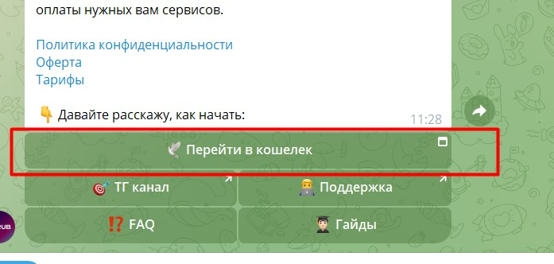
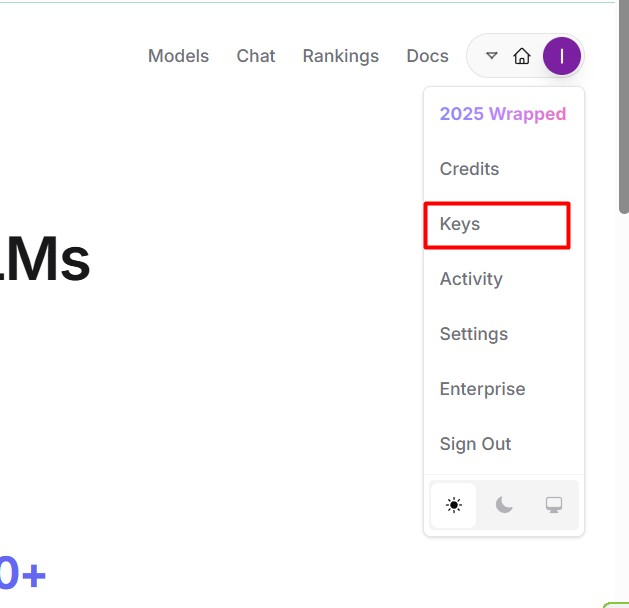
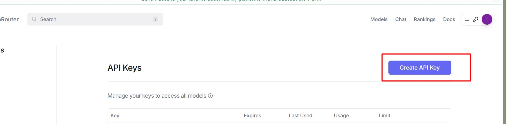

# 📚 Enterprise Legal & HR RAG System

**AI-помощник для юридического и HR отделов на базе Qdrant, OpenRouter и Groq.**

Эта система автоматизирует поиск по сотням страниц внутренних регламентов, трудовых договоров и юридических актов предприятия. Позволяет сотрудникам получать мгновенные, точные ответы со ссылками на источники вместо 4-часового ручного поиска.

## 📊 Результаты внедрения
* **30 секунд** вместо 4 часов на поиск нужного пункта в регламенте.
* **95% точность** выдачи контекста, исключающая юридические ошибки и "галлюцинации" ИИ.
* Бесшовная интеграция в корпоративный Telegram или портал.

---

## ⚙️ Архитектура системы (n8n Workflow)
Система работает в связке с локальными и быстрыми LLM через Groq / OpenRouter для максимальной скорости и безопасности данных.

### Основные компоненты:
1. **Векторная база данных**: Хранение документов (Qdrant / Pinecone).
2. **Embeddings Engine**: Python-скрипт (`embed_images.py`) для подготовки и векторизации базы знаний.
3. **Retrieval-Augmented Generation (RAG)**: Логика извлечения релевантного контекста.
4. **LLM**: Быстрая генерация ответа на базе извлеченных данных.

---

## ⚡ Демонстрация работы модулей

**1. Подключение и работа через Groq (Локальные высокоскоростные ответы):**

**2. Интеграция с OpenRouter для сложных юридических моделей:**

---

## 🛠 Технологический стек
* **Оркестрация**: n8n
* **Embeddings & Scripts**: Python 3.12, Pinecone / Qdrant
* **LLM API**: OpenRouter (Claude 3.5 Sonnet / Llama 3), Groq
* **Интерфейс**: Telegram Bot API

## 🚀 Детальная документация
Внутри репозитория доступны подробные инструкции по развертыванию:
* `HR_RAG_COMPLETE_GUIDE.md` 
* `DETAILED_IMPLEMENTATION_GUIDE.md`
